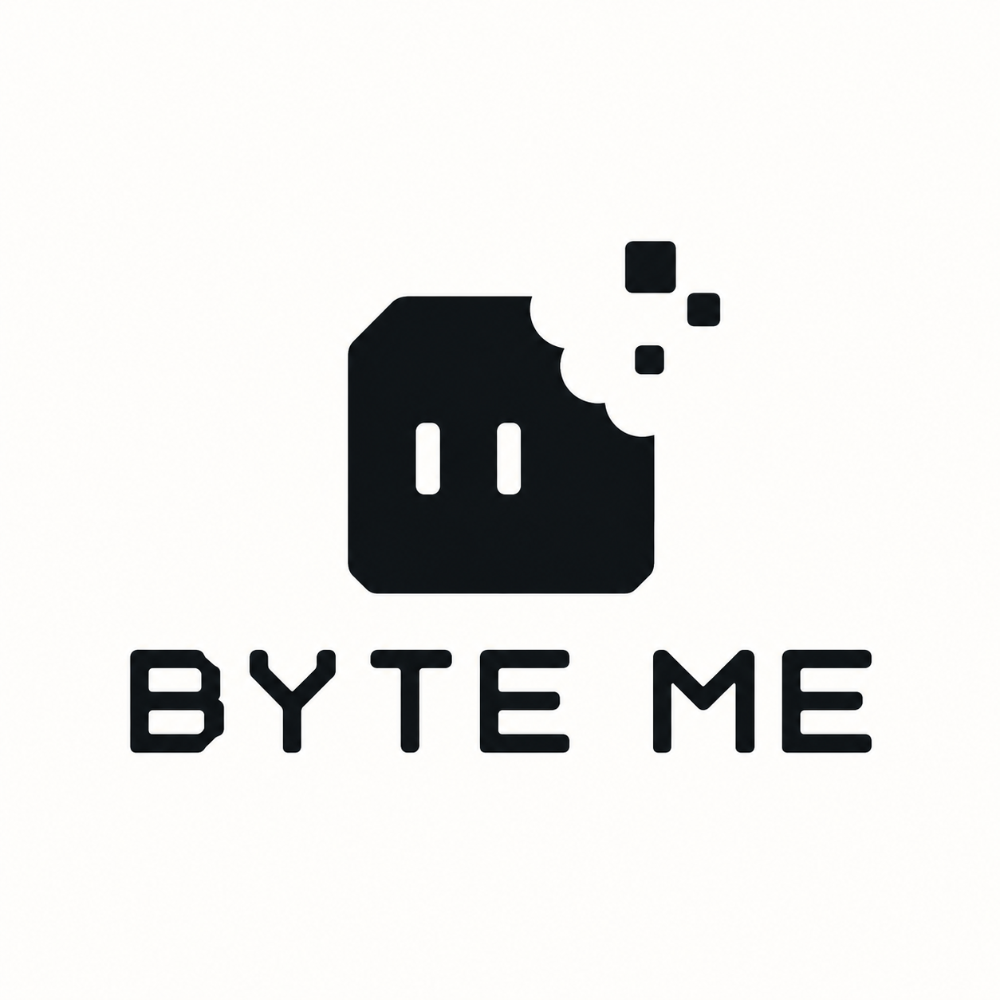
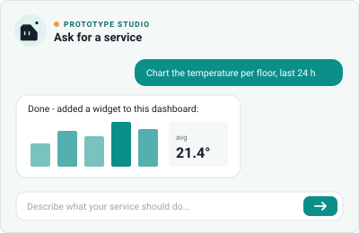

# Prototype Editor



A Cockpit dashboard widget for chatting with the `c8y-fn-author` AI agent. Describe the data you need in plain language. The agent writes a small data function, deploys it to the function service (`proto-fn-service`) and can add a widget with the result straight to the dashboard you are on.



## Features

- **Chat on the dashboard:** the conversation lives in the widget. Enter sends, Shift+Enter adds a new line.
- **Knows the dashboard:** the current dashboard ID is sent with every message, so the agent adds widgets to this dashboard without you copying IDs.
- **Refreshes when needed:** the dashboard reloads only when the agent actually changed it.
- **Private per user:** chat history is stored in the browser, keyed by tenant, user and dashboard, and capped at 40 messages. **Clear** removes it.
- **Markdown replies:** agent answers are rendered as sanitized markdown.

## Requirements

- Cumulocity Web SDK / platform version 1024.18.x and Cockpit
- The **AI Agent Manager** with a configured `c8y-fn-author` agent (reached at `/service/ai/agent/text/c8y-fn-author`)
- The `proto-fn-service` microservice deployed on the tenant (reached at `/service/proto-fn`)
- The `ROLE_PROTO_FN_CREATE` role for users who should be able to deploy functions and add widgets

## Install

1. Download `prototype-editor-plugin.zip` from the **Build frontend** GitHub Action, or build it locally (see below).
2. In **Administration → Ecosystem → Extensions**, upload the zip.
3. Open **Administration → Ecosystem → Applications → Cockpit** (clone it first if it is the built-in one), go to **Plugins** and install **Prototype Editor plugin**.
4. On a Cockpit dashboard, click **Add widget** and pick **Prototype Editor**.

## Develop

```sh
npm ci
npm start                    # serves the widget inside Cockpit of the tenant set in package.json
npm run build                # dist/prototype-editor-plugin.zip
npm run deploy               # uploads the build to a tenant (ng deploy)
```

Change the `-u` URL in the `start` script to point at your own tenant.

## Module Federation

The plugin is loaded at runtime into the Cockpit shell through Webpack Module Federation (`cumulocity.config.ts`):

- `remotes` / `exports` expose `PrototypeEditorModule`, which registers the widget via `hookWidget`.
- `buildTime.federation` lists the packages shared with the shell as singletons: Angular, `@c8y/client`, `@c8y/ngx-components`, ngx-translate and formly. Every package in that list must be installed at the **same major version as the shell** (Web SDK 1024.18 → Angular 21), otherwise the plugin gets its own copy and dependency injection breaks.
- Anything not in the list, like `marked`, is bundled into the plugin.
- Images must be imported (see `src/assets/index.d.ts`) so they get bundled; relative URLs do not resolve once the plugin runs inside the shell.

## Project layout

| Path | Purpose |
| --- | --- |
| `src/app/prototype-editor/prototype-editor.module.ts` | Widget definition and `hookWidget` registration |
| `src/app/prototype-editor/prototype-editor.component.*` | Chat UI, persistence, dashboard refresh |
| `src/app/prototype-editor/prototype-editor.service.ts` | Calls to the agent and `proto-fn-service` |
| `src/app/prototype-editor/markdown.pipe.ts` | Sanitized markdown rendering of agent replies |
| `src/locales/*.po` | Translations for the widget name and description |
| `cumulocity.config.ts` | Plugin manifest, exports and federation config |

## Technology

- Cumulocity Web SDK 1024.18.1
- Angular 21.2
- marked 18
